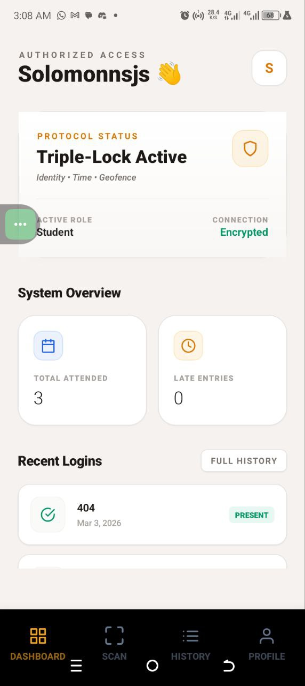
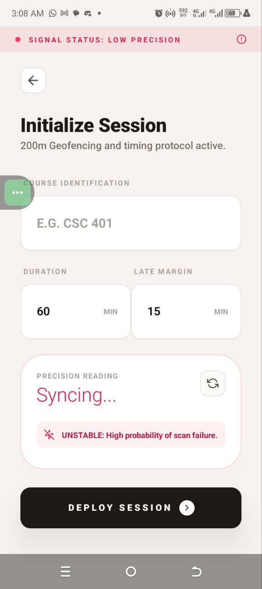
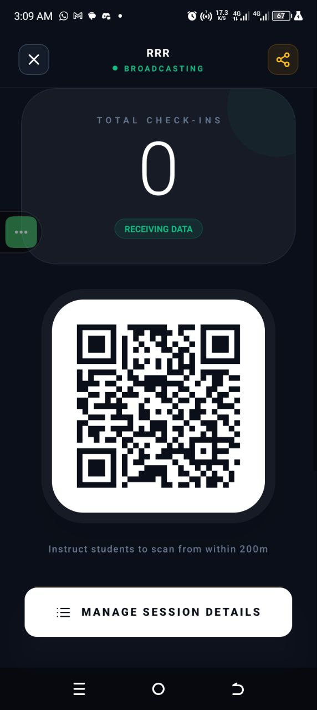

# Smart Attendance 📱

[](https://expo.dev)
[](https://reactnative.dev)
[](https://www.nativewind.dev)

**Smart Attendance** is a secure, geofenced mobile app for classroom attendance management. Professors create QR-based sessions with GPS verification (200m radius), time limits, and late detection. Students scan QR codes to mark attendance securely. Features triple-lock security: identity (JWT), time, and geofence.

Built with Expo Router, React Native Reanimated, Expo Location/Camera, and Tailwind CSS (NativeWind).

## ✨ Features

### For Professors
- **Create Secure Sessions**: Set course code, duration, late margin; auto-generates QR + backup code.
- **Live QR Display**: Real-time attendee count, session stats.
- **Geofencing**: 200m GPS radius enforcement.
- **Session Management**: View details, history, attendees.

### For Students
- **QR Scanning**: Camera-based secure check-in within geofence/time window.
- **Dashboard**: Attendance stats (attended/late), recent history.
- **Profile & History**: Personal attendance log.

### Security & UX
- GPS precision checks (±20m ideal), encrypted API (JWT).
- Role-based UI (tabs adapt: CREATE/SCAN).
- Dark/light themes, haptics, sharing.
- Permissions: Camera, Location (foreground/background).

## 📱 Screenshots

| Dashboard (Student) | Create Session (Professor) | Live QR Display |
|--------------------|----------------------------|-----------------|
|   |  |  |

## 🚀 Quick Start

1. **Clone & Install**
   ```bash
   git clone <your-repo> student-attendance-app
   cd student-attendance-app
   npm install
   ```

2. **Run the App**
   ```bash
   npx expo start
   ```
   - **iOS Simulator**: `i` (Cmd+D on iOS)
   - **Android Emulator**: `a`
   - **Web**: `w`
   - Scan QR with [Expo Go](https://expo.dev/go)

3. **Test Flow**
   - Register/Login (roles: professor/student).
   - Professor: Tabs → CREATE → Set course/GPS → Display QR.
   - Student: Tabs → SCAN → Camera QR scan (within session).

**Backend**: Uses public API `https://studentattendanceapi-v4hq.onrender.com` (no local setup needed).

## 🏗️ Project Structure

```
app/
├── _layout.js          # Root layout
├── (auth)/             # Login/Register/Forgot
├── (tabs)/             # Role-based tabs: home/action/history/profile
├── (professor)/        # create-session.js
└── attendance/         # display-qr.js, session-details.js
services/
├── api.js              # Axios wrappers
└── qrService.js        # QR utils
assets/images/          # Icons, splash
```

## 🔧 Development

- **Styling**: NativeWind (Tailwind) + global.css.
- **Routing**: Expo Router (file-based).
- **State**: AsyncStorage (user/token), React hooks.
- **API Endpoints** (example):
  | Method | Endpoint | Desc |
  |--------|----------|------|
  | POST | `/api/attendance/session` | Create session |
  | GET | `/api/attendance/session-details/:id` | Live attendees |
  | GET | `/api/attendance/professor/sessions` | Professor dashboard |

- **Permissions** (app.json): Camera, Location (coarse/fine).
- **Lint**: `npm run lint`
- **Reset**: `npm run reset-project` (clears app/)

## 📦 Build & Deploy

Using [EAS Build](https://expo.dev/eas):
```bash
eas login
eas build --platform all --profile preview
```

Configs: `eas.json` (projectId: 61a35fbd-1786-428b-9e21-0c3108b39bd4).

- **iOS Bundle**: com.yourname.smartattendance
- **Android Package**: com.yourname.smartattendance

## 🤝 Contributing

1. Fork & PR.
2. Follow ESLint/TypeScript.
3. Add tests for new features.
4. Update README.

Issues? [Open one](https://github.com/yourusername/student-attendance-app/issues).

## 📄 License

MIT License - see [LICENSE](LICENSE)

## 🙌 Credits

- [Expo](https://expo.dev)
- [NativeWind](https://nativewind.dev)
- Backend API by Agonix Tech Solutions.

---

**⭐ Star on GitHub if useful!** 👨‍🎓👨‍🏫

